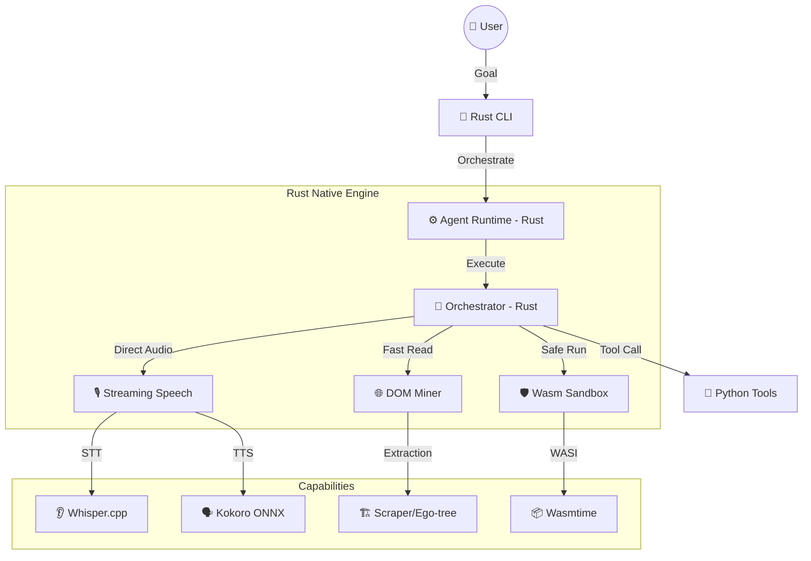

# 🌌 S.U.N.D.A.Y (v2.0 Native Edition)

### **Self-improving Unified Network for Desktop Automation & Yardsticking**

SUNDAY is a next-generation, autonomous agent runtime that has evolved from a Python-based prototype into a **High-Performance Rust-Native Engine**. Built for extreme speed, local privacy, and self-evolution, SUNDAY v2.0 leverages Rust to eliminate traditional AI bottlenecks.

---

## 🏗️ New Architecture: Rust-Native Core

SUNDAY now utilizes a **Hybrid Multi-Engine** architecture where performance-critical components are implemented in Native Rust, while maintaining Python's flexibility for high-level UI and rapid prototyping.



---

## 🚀 Performance & Security Revolution

### 🏎️ **Native Orchestration & Parsing**
The core **Thought-Tool-Observation** loop is now implemented in Rust. Using compiled regexes and zero-copy message handling, SUNDAY handles complex reasoning and tool-routing in sub-millisecond time, bypassing the Python GIL.

### 🎙️ **Zero-Latency Streaming Speech**
Moved from file-based STT/TTS to **In-Memory Streaming**:
- **STT:** Whisper transcription via `candle` (Pure Rust) processing audio directly in RAM.
- **TTS:** High-quality synthesis via `Kokoro-ONNX` (ORT), eliminating the need for heavy Python dependencies like `numpy` or temporary `.wav` files.

### 🛡️ **Wasm Security Sandbox**
AI-generated code now runs in a dedicated **WebAssembly (Wasmtime)** sandbox.
- **Isolation:** 100% isolation from the host system.
- **Resource Control:** Strict fuel limiting to prevent infinite loops or memory exhaustion.

### 🌐 **High-Speed DOM Mining**
Browser data extraction is powered by `sunday-mining` (Rust). It parses massive HTML trees 10-100x faster than traditional Python libraries, allowing agents to "see" and "interact" with complex web pages instantly.

---

## 🛠️ Tech Stack

- **Core Runtime:** Rust (Tokio, Rig-core, OnceCell)
- **ML Inference:** Candle (STT), ONNX Runtime (TTS/Vision), Llama.cpp (LLM)
- **Security:** Wasmtime + WASI
- **Browser:** Chromiumoxide (Rust) + Playwright (Python)
- **Automation:** Python 3.12 (uv) for legacy tool support

---

## 📂 Project Structure

```bash
SUNDAY/
├── rust/crates/           # 🦀 Native Rust Core
│   ├── sunday-agents/     # Orchestrator & Multi-turn logic
│   ├── sunday-core/       # Shared types, EventBus, Telemetry
│   ├── sunday-speech/     # Streaming STT (Whisper) & TTS (Kokoro)
│   ├── sunday-mining/     # High-speed DOM parsing
│   └── sunday-sandbox/    # Wasmtime code execution
├── src/sunday/            # 🐍 Python Orchestration & UI
│   ├── agents/            # Legacy Python agents
│   └── tools/             # Auto-discovered capabilities
├── frontend/              # 🎨 Web Dashboard (Next.js/Vite)
└── configs/               # ⚙️ Model & Tool configurations
```

---

## 🏁 Quick Start

Ensure you have `Rust` and `uv` installed.

1. **Build the Native Engine:**
   ```bash
   cd rust
   cargo build --release
   ```

2. **Start the Integrated Runtime:**
   ```powershell
   .\start_sunday_all.ps1
   ```

---

## 📜 License
This project is a personal fork of the **OpenJarvis/SUNDAY** stack, maintaining the **Apache 2.0 License**.
Developed with 💜 for high-performance autonomous agents.