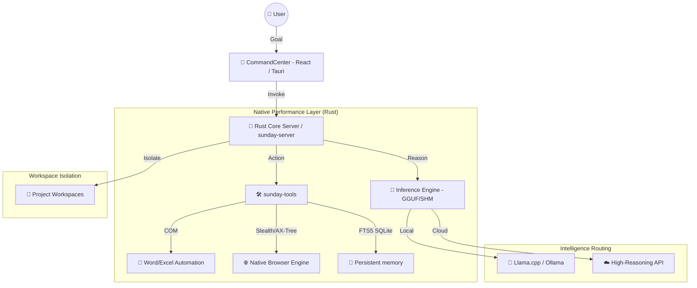

# 🌌 S.U.N.D.A.Y (v3.0 Super Agent Edition)

<p align="center">
  
</p>

### **Self-improving Unified Network for Desktop Automation & Yardsticking**

**SUNDAY** is a state-of-the-art, high-performance autonomous agent runtime. It is a **Rust-Native Powerhouse** designed for extreme speed, local privacy, and deep desktop operating systems integration. SUNDAY doesn't just chat; it **operates** your desktop, browser, and office suite with human-like reasoning, multi-turn tool calling, and machine-like precision.

---

## ⚡ Core Philosophy: "Performance as a Feature"
Traditional AI agents are slowed down by high-latency APIs, heavy Python overhead, and brittle browser tools. SUNDAY breaks these barriers:
- **Rust-Native Core:** Core logic, DOM mining, and local inference bridges are built from the ground up in **Rust**.
- **Super-Agent Toolset:** Integrates the capability of elite runtimes like **Manus, Claude Code, Codex, and OpenWork**.
- **Stealth Networking:** Injected realistic browser identities to bypass Cloudflare/API rate limits effortlessly.
- **Local-First with Zero-Copy:** Optimizations for GGUF (Llama.cpp) and Ollama using shared memory (SHM).

---

## 🚀 Key Features & Agent Suites

### 🌐 **OpenWork & Antigravity Browser Engine**
Goes beyond simple browser scraping. SUNDAY maps and acts on the web visually and semantically:
- **AX-Tree Tracking (`browser_view_tree`):** Extracts simplified accessibility node trees from active web pages, mapping elements to unique index IDs (e.g. `[1] button: "Login"`).
- **Stealth Element ID Resolution:** Agent can click or type into elements simply using numbers (e.g. `browser_click("12")`), which automatically maps under the hood to native element attributes.
- **Human-like Interactions:** Smooth mouse movements, randomized keystroke delays, and automatic realistic Chrome/Windows User-Agent headers to stay undetected.
- **Fast Mining:** Native Rust-based DOM extraction (`sunday-mining`) performing 10-100x faster than Playwright/Puppeteer wrappers.

### 🧠 **Manus-Style Planning & Memory Persistence**
- **Roadmap Management (`task_planner`):** Enables the agent to autonomously structure long-horizon goals, map execution roadmaps, and maintain an active task board.
- **SQLite Memory Search (`memory_store` / `memory_search`):** Permanent context memory using case-insensitive FTS5 full-text indexing, allowing the agent to remember facts across different turns and sessions.

### 📂 **Claude Code & Codex Workspace Tools**
- **Symbol Analysis (`code_analyzer`):** High-speed static extraction of symbols (functions, classes, structs, types) from directories.
- **Project Structure (`repo_map`):** Generates zero-dependency directory tree representations instantly.
- **Batch Processing (`read_multiple_files`):** Allows high-throughput multiple-file context access at once.

### 📁 **Native Office Automation**
- **Word & Excel Bridge:** Native COM interface automation allows compiling reports, running calculations, and formatting documents on the fly without intermediate files.

---

## 🏗️ Technical Architecture



---

## 🛠️ Tech Stack

- **Backend:** Rust (Axum, Tokio, Rig-core, Windows-rs, Chromiumoxide)
- **Frontend:** React, TypeScript, Tailwind CSS, Framer Motion, Lucide Icons
- **Desktop Wrapper:** Tauri (Native Performance & Security)
- **AI/ML:** Llama.cpp (GGUF), ONNX Runtime, Whisper (Streaming STT), Kokoro (TTS)
- **Communication:** Bidirectional Discord gateways, Voice Live overlay, CLI, and Web.

---

## 📂 Project Structure

```bash
SUNDAY/
├── rust/crates/           # 🦀 High-Performance Native Core Workspace
│   ├── sunday-core/       # Shared types, Event Bus & Loop Guards
│   ├── sunday-tools/      # Native Tools (Office, Browser, Memory, Workspace)
│   ├── sunday-engine/     # Inference management & GGUF Llama.cpp
│   ├── sunday-sessions/   # Persistent session & history
│   ├── sunday-mining/     # High-speed DOM parsing
│   └── sunday-server/     # High-performance Axum SSE server
├── frontend/              # 🎨 CommandCenter UI (React/Vite/Tauri)
├── desktop/               # 🖥️ Tauri Desktop Configuration
└── workspaces/            # 📂 Isolated Task Environments
```

---

## 🏁 Getting Started

### Prerequisites
- [Rust](https://rustup.rs/) (Stable)
- Windows OS (with Microsoft Office installed for native COM features)

### Quick Start
1. **Clone & Setup:**
   ```bash
   git clone https://github.com/kungslowjam/S.U.N.D.A.Y.git
   cd S.U.N.D.A.Y
   ```

2. **Run All Services (Engine, Server, Frontend, Discord):**
   ```powershell
   # Boot the entire super-agent stack with one click
   .\rust\target\release\sunday-cli.exe start --all
   ```

3. **Or Compile from Source:**
   ```bash
   cd rust
   cargo build --release -p sunday-server
   ```

---

## 📜 License & Acknowledgments
This project is an advanced fork of the **OpenJarvis/SUNDAY** stack, maintaining the **Apache 2.0 License**.
Developed with 💜 for high-performance autonomous agents that actually get things done.

---
*“S.U.N.D.A.Y: Because the future isn't just about chatting with AI, it's about AI operating the future.”*